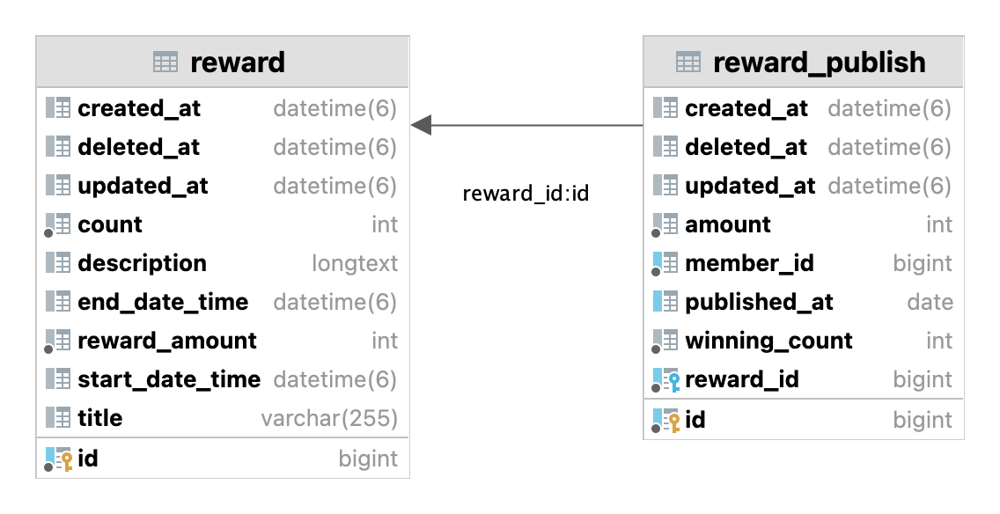

# 실행

```
# git clone
$git clone git@github.com:cocodori/reward-service.git

# 프로젝트 디렉터리로 이동
$cd ./reward-service

# 도커 실행 후 docker compose 실행
$docker compose up -d

# 테스트 -> 빌드 -> 실행
$./gradlew clean test build && java -jar reward-api/build/libs/*.jar 
```

# API
### API DOCUMENT

https://documenter.getpostman.com/view/15834244/2s8YsxuApx

### 보상 데이터 조회 API
```
request:
GET: http://localhost:8080/api/v1/rewards/{rewardId}
(testRewardId: 1)

response:
{
    "content": {
        "id": 1, # rewardId
        "title": "매일 00시 00분 00초 선착순 10명 100포인트 지급!!",
        "description": "- 보상 지급 방식은 사용자가 받기를 누를 때 지급하게 됩니다."
    }
}


```

### 보상 지급 API
```aidl
request:
POST: http://localhost:8080/api/v1/rewards/publish

response:
{
    "content": {
        "memberId": 1, # 지급 받은 유저
        "amount": 100,  # 지급 금액
        "winningCount": 1 # 연속으로 지급 받은 횟수
    }
}
```

### 보상 조회 API
```
request:
http://localhost:8080/api/v1/rewards/winners?rewardId=1&publishedAt=2022-11-28&orderBy=DESC

response:
{
    "content": [
        {
            "publishId": 12,
            "rewardId": 1,
            "memberId": 10,
            "winningCount": 1,
            "amount": 100
        },
        {
            "publishId": 11,
            "rewardId": 1,
            "memberId": 9,
            "winningCount": 1,
            "amount": 100
        },
        ....생략
    ]
}
```


# 문제 해결 전략
## ERD


(구현의 편의를 위해 유저 테이블은 따로 생성하지 않았습니다.)

- reward
  - 보상 지급 같은 이벤트를 등록하고 관리하는 테이블.
  - Reward에는 하루에 몇 개를 발급할 수 있는지(`count`), 얼마를 지급할 것인지(`rewardAmount`)에 대한 데이터가 들어있습니다.

- reward_publish
  - reward에 등록된 보상 이벤트를 유저에게 지급할 때마다 지급 내역을 관리하는 테이블
  - reward_publish는 이 유저가 몇 번 연속으로 보상금을 지급 받았는지(`winningCount`), 그래서 얼마를 지급 받았는지(`amount`)등의 데이터를 관맇바니다.

각 테이블 컬럼 정보는 `reward-api/src/main/resources/schema.sql` 스키마 정의 파일에 코멘트로 달아두었습니다.


## 모듈 구성

이 프로젝트는 세 가지 모듈로 구성했습니다.

- reward-api
- reward-core
- reward-redis

단일 모듈로 구성하지 않고 멀티 모듈로 구성한 이유는 모듈 별 책임을 명확하게 나누어, 프로젝트 크기가 커지더라도 의존성이 한 방향으로만 흐르게 만들어 의존성이 꼬이지 않도록 만들었습니다.

각 모듈은 객체지향 원칙에 따라 반드시 인터페이스를 통해 협력하도록 만들었고 상세 구현은 `internal`로 제한함으로써 다른 모듈의 구현을 참조할 수 없도록 접근 제어했습니다.

## 적절히 책임을 분배하는 설계

모듈 내에서도 비즈니스 로직 처리를 계층 구조로 설계하여 하나의 클래스가 큰 책임을 가지지 않도록 적절하게 분리했습니다.

간단한 예로, core 모듈의 구성을 설명하겠습니다. 

- `Interface: RewardService`
  - 외부 모듈이 reward-core 모듈에 접근할 때 사용하는 인터페이스
- `DefaultRewardService`
  -  RewardService 사용하는 기본 구현입니다. 외부에는 공개되지 않습니다. 이 기본구현은 직접 비즈니스 로직을 처리하지 않고, 알맞은 클래스에게 요청을 위임합니다.
- `RewardCreateService`, `RewardFindService`, `RewardPublishService`
  - `DefaultRewardService`로부터 요청을 위임받아 실제 비즈니스 로직을 실행합니다.
    
## Test

### Integration Test
요구사항 문서에 나오는 세 개의 API에 대한 통합테스트를 모두 작성했습니다. 성공하는 경우 뿐 아니라 실패하는 경우까지 예상한 대로 실패하는지에 대한 테스트를 작성했습니다.

### Unit Test
각 비즈니스 요구사항에 대한 테스트를 진행했습니다. 특히 보상금 지급 로직의 경우 여러 제약 조건이 있기 때문에 더 꼼꼼하게 작성했습니다.

예를 들어 3일, 5일, 10일 연속으로 지급받은 유저에게 더 큰 금액을 지급하는지, 당일에 2번 이상 지급 받으려는 유저에게 적절한 예외를 발생시키는지에 대한 테스트를 진행했습니다.

### Concurrency Test
동시에 수많은 유저가 접근하여 보상금 지급을 요청할 경우 레이스 컨디션이 발생하여 10명 이상의 사용자에게 보상금을 지급하게 되는 문제가 발생할 수 있습니다.
이 문제를 Redisson으로 분산 락을 구현하여 해결했습니다. Redisson으로 순차적으로 지급 로직에 진입하도록 만들었고, Spring AOP을 적용해 애노테이션으로 어디에서든 사용할 수 있도록 확장성있게 설계했습니다.
비즈니스 로직에 코드를 추가하지 않고 동시성 문제를 해결했습니다.

## 예외 처리
모든 예외는 적절한 CustomException을 만들어서 처리했고, 예외 코드(`ErrorCode`) 등을 추상화하여 일관적인 예외를 클라이언트에게 반환하도록 설계했습니다.
모든 예외는 ControllerAdvice가 잡아서 직접 정의한 `ErrorResposne`형식에 맞게 리턴합니다. 에러에 따라 응답이 바뀌는 상황을 만들지 않고 일관성을 지키기 위해 노력했습니다.


